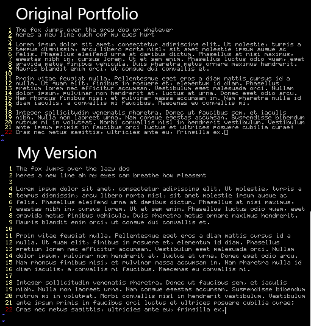

## iPortfolio
Modified version of Mx437_Portfolio_6x8.ttf taken from OldSchool PC Fonts 
https://int10h.org/oldschool-pc-fonts/fontlist/font?portfolio_6x8

I enjoyed this font for a long time as it lets me have 160 columns in my terminal on my 1024x768 screen, but after not much time my eyes would begin to strain due to how close the lines were together. I added some more space inbetween the lines with FontCreator 11 and now share here.

